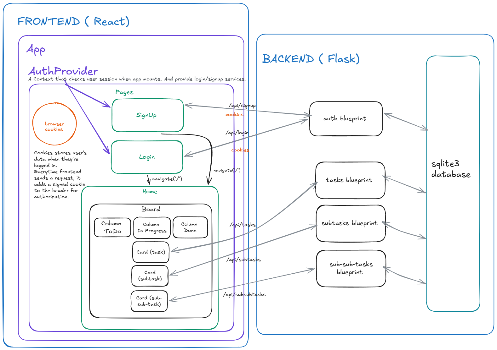

# TaskBoard

A full-stack Kanban-style task management app with user authentication. Users can create, organize, and manage tasks across three status columns (To Do, In Progress, Done), with drag-and-drop support and nested subtasks.

## Github repository link:
---

## Tech Stack

| Layer      | Technology                          |
|------------|-------------------------------------|
| Frontend   | React  
| Backend    | Flask, SQLite3                      |
| Auth       | Flask session (signed cookie)       |
| Dev Server | Vite                                |

---

## Features

- **Authentication** — Register, login, logout with session-based auth
- **Per-user data** — Each user sees only their own tasks
- **Kanban board** — Three columns: To Do, In Progress, Done
- **Drag & drop** — Move tasks between columns via drag
- **Nested tasks** — Tasks support subtasks and sub-subtasks
- **Protected routes** — Users must be authenticated to access the board. Unauthenticated users are redirected to `/login`

---

## Project Structure

```
cs162-todoapp/
├── frontend/               # React app (Vite)
│   └── src/
│       ├── components/
│       │   ├── Board/      # Kanban board + all task logic
│       │   ├── Column/     # Single status column
│       │   ├── Card/       # Task card (with subtasks)
│       │   └── ProtectedRoute.jsx
│       ├── context/
│       │   └── AuthContext.jsx   # login, signup, logout, session check
│       └── pages/
│           ├── Login.jsx
│           ├── Register.jsx
│           └── Home.jsx
│
└── backend/                # Flask API
    └── app/
        ├── routes/
        │   ├── auth.py         # /api/login, /api/signup, /api/logout, /api/me
        │   ├── tasks.py        # /api/tasks (CRUD operations with sqlite3)
        │   ├── subtasks.py
        │   └── subsubtasks.py
        ├── extensions.py       # DB init + schema
        └── config.py
```

---

## Getting Started

### Prerequisites

- Python 3.10+
- Node.js 18+

### Backend

```bash
cd backend
python -m venv venv
source venv/bin/activate        # Windows: venv\Scripts\activate
pip install -r requirements.txt
flask run
```


### Frontend

```bash
cd frontend
npm install
npm run dev
```


> The frontend proxies `/api/*` requests to the Flask backend via Vite's dev server config.

---

## API Reference

### Auth

| Method | Endpoint       | Description                | Auth required |
|--------|----------------|----------------------------|---------------|
| POST   | `/api/signup`  | Create a new user account  | No            |
| POST   | `/api/login`   | Log in and start a session | No            |
| POST   | `/api/logout`  | End the current session    | Yes           |
| GET    | `/api/me`      | Get the current user       | Yes           |

### Tasks

| Method | Endpoint           | Description                        | Auth required |
|--------|--------------------|------------------------------------|---------------|
| GET    | `/api/tasks`       | Get all tasks for the current user | Yes           |
| POST   | `/api/tasks`       | Create a new task                  | Yes           |
| PATCH  | `/api/tasks/<id>`  | Update a task's fields or status   | Yes           |
| DELETE | `/api/tasks/<id>`  | Delete a task and its subtasks     | Yes           |

Subtask and sub-subtask endpoints follow the same pattern under `/api/subtasks` and `/api/subsubtasks`.

---

## Authentication Flow

1. On login/signup, the server sets a signed session cookie
2. On every subsequent request, the browser sends the cookie automatically
3. On app load, the frontend calls `GET /api/me` to restore the session
4. `ProtectedRoute` redirects unauthenticated users to `/login`
5. All task endpoints verify `session['user_id']` and filter data by user

---

## Database Schema

```sql
users         (id, name, email, password_hash, created_at)
tasks         (id, list_id, user_id, title, description, deadline, ...)
subtasks      (id, parent_task_id, title, description, deadline, status, ...)
subsubtasks   (id, parent_task_id, title, description, deadline, status, ...)
status_lists  (id, title)   -- seeded with: todo, in-progress, done
```

## App Schema



## Demo Video

[Watch on Loom](https://www.loom.com/share/77dc1d1ae2ef4494964a5b639ced8d7b)

